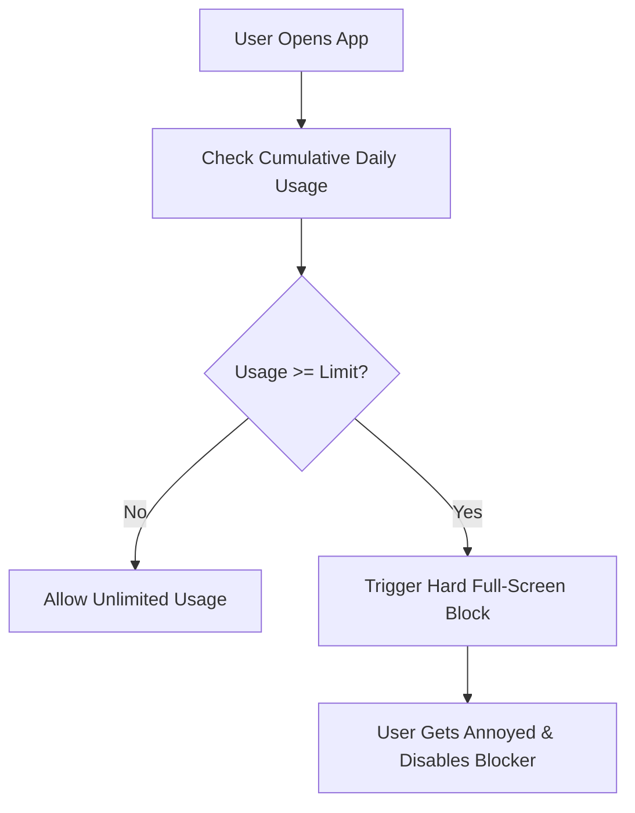
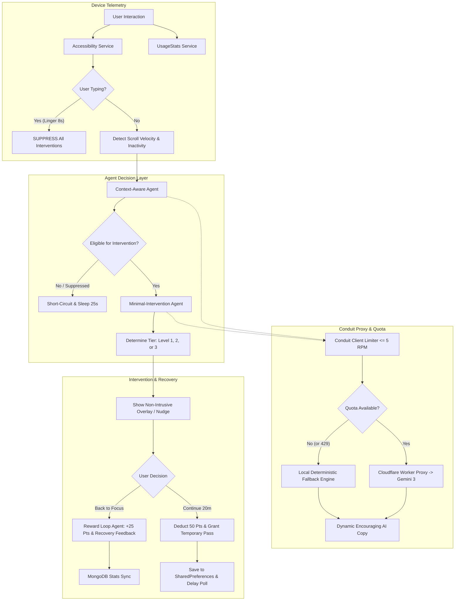
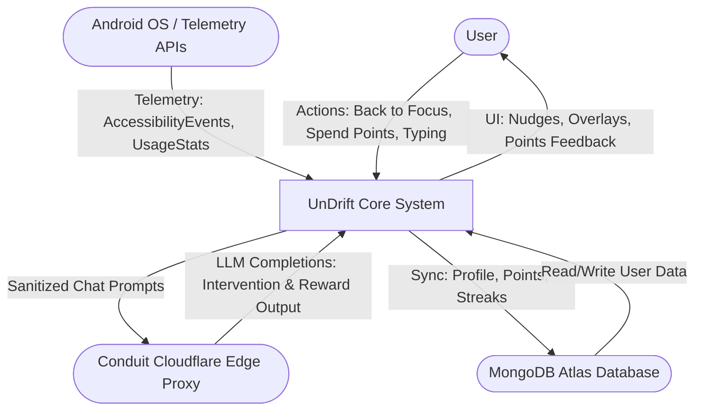
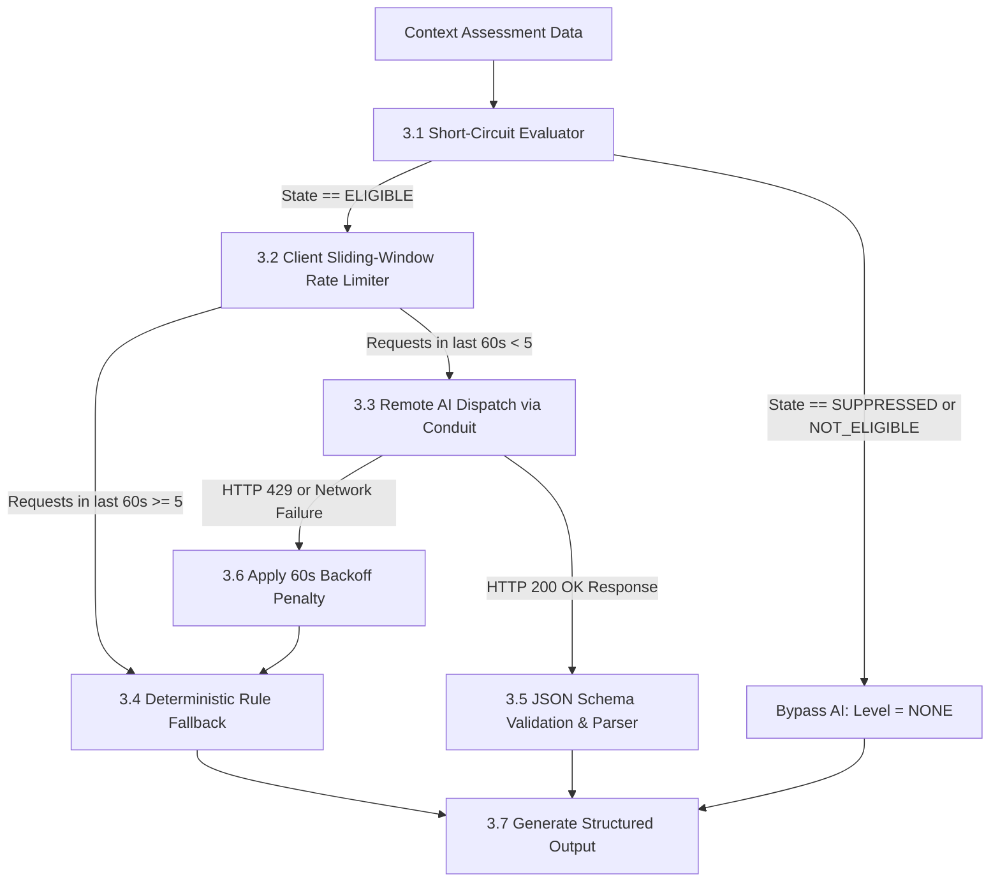
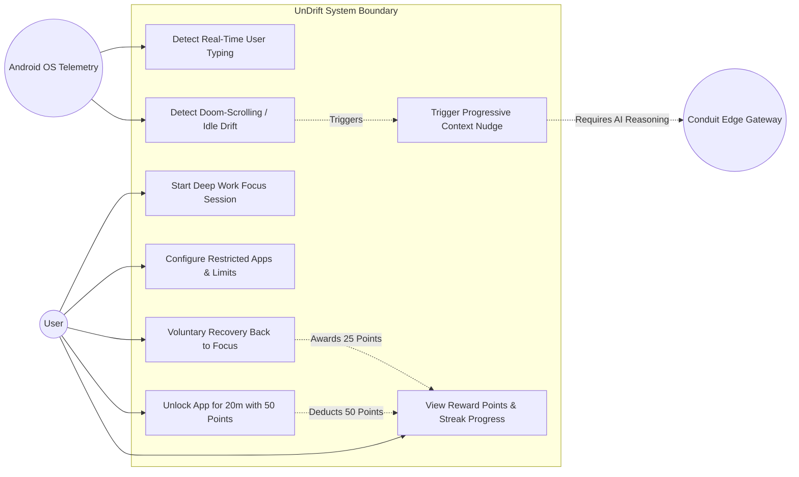
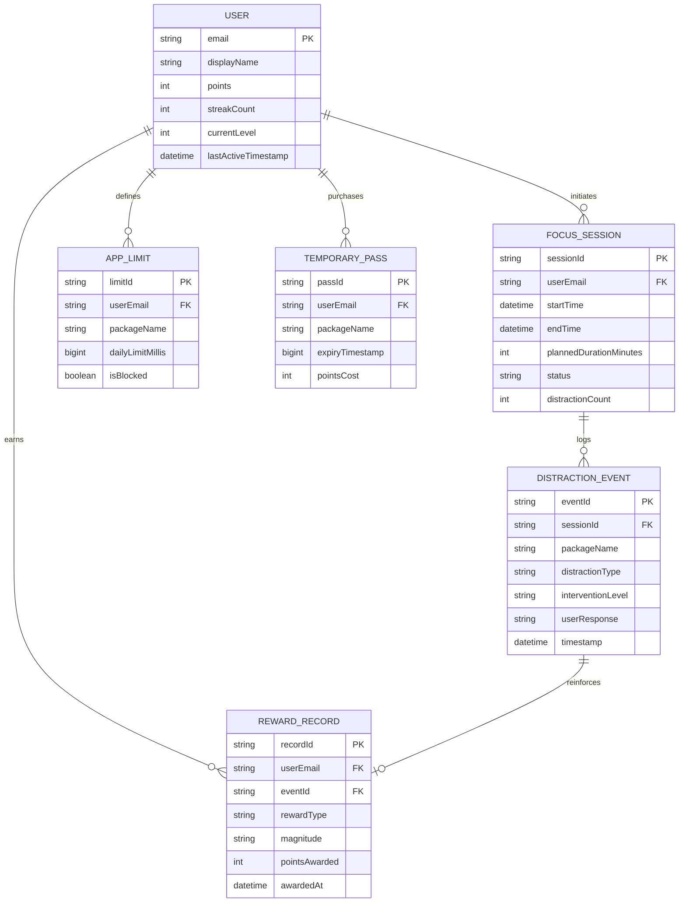

# PROJECT DOCUMENTATION: UNDRIFT
## An Intelligent, Context-Aware Multi-Agent Anti-Procrastination System

---

# 1. Introduction

## 1.1 General Introduction
In contemporary digital environments, smartphones have transformed from utilitarian communication instruments into sophisticated attention-capture ecosystems. Consumer mobile applications—particularly short-form video platforms, social networks, and algorithmic news aggregators—are intentionally engineered using variable reward schedules and frictionless infinite scrolling to maximize user dwell time. This phenomenon frequently induces **involuntary digital drift**, wherein users unconsciously divert cognitive bandwidth from intended, goal-directed tasks toward low-value digital consumption.

**UnDrift** is an intelligent, context-aware anti-procrastination Android application engineered to help users maintain focus and overcome digital inertia **without turning their smartphone into an unusable digital prison**. Traditional screen-time management tools operate on rigid, punitive paradigms—such as blocking entire applications outright or bombarding users with generic timer pop-ups—which frequently disrupts legitimate workflows (e.g., replying to an urgent message) and causes users to disable the app out of frustration.

UnDrift re-engineers digital wellbeing around a collaborative human-in-the-loop multi-agent architecture:
1. **Context-Aware Agent**: Distinguishes intentional smartphone utility (active typing, purposeful task execution) from passive, involuntary distraction (doom-scrolling velocity, feed idling).
2. **Minimal-Intervention Agent**: Employs behavioral psychology (escalating intervention levels, cooldowns, and non-judgmental reflective messaging) to nudge users back on track with the least intrusive barrier required.
3. **Reward Loop Agent**: Closes the operant conditioning loop by recognizing recovery and milestones, reinforcing positive behavioral plasticity via a gamified point economy.
4. **Conduit AI Proxy Gateway**: A high-performance, serverless edge proxy (Cloudflare Workers) that abstracts LLM providers (Google Gemini 3 family), enforces client-side sliding-window rate limiting (5 RPM quota protection), and guarantees zero-downtime offline rule fallbacks.

The philosophy of UnDrift is simple: **Productivity is not about never getting distracted; it is about building the metacognitive muscle to notice the drift and effortlessly return to focus.**

```
               DIGITAL BEHAVIORAL FEEDBACK LOOP
     ┌─────────────────────────────────────────────────────┐
     ▼                                                     │
[User Drift] ──► [Awareness] ──► [Recovery] ──► [Focus] ───┴──► [Progress]
 (Doomscroll/    (Context-Aware   (Minimal-     (Restored Deep    (Reward Loop
    Idle)           Agent)       Intervention)      Work)          & Points)
```

---

## 1.2 Problem Definition
Contemporary screen-time managers and website blockers suffer from several critical design and architectural shortcomings:
1. **Context Blindness**: Existing blockers treat all interactions with a "blacklisted" application identically. For example, opening Instagram or WhatsApp to send a crucial business reply is treated identically to 45 minutes of mindless Reels browsing.
2. **Invasive & Counterproductive Blocking**: Forcing full-screen hard blocks while a user is actively typing in a search bar or compose field breeds user resentment, triggering uninstallation or permission revocation.
3. **Binary All-or-Nothing Interventions**: Blockers either lock an app entirely or let the user browse indefinitely. They fail to implement progressive awareness stages (awareness $\rightarrow$ reflection $\rightarrow$ return-to-focus).
4. **Punitive Psychology**: Traditional apps punish users with guilt trips, restrictive timers, and negative feedback, which psychological studies show leads to avoidance behaviors rather than sustainable habit reformation.
5. **High Latency & Rate Limit Vulnerability**: Modern mobile apps integrating frontier LLMs face severe provider rate limits (e.g., 5 Requests Per Minute on free tiers) and latency spikes. Unhandled API limits lead to app freezes, ANRs (Application Not Responding), and broken blocker triggers.

---

## 1.3 Motivation
Human self-regulation is an exhaustible cognitive resource. When willpower depletes, users experience **"drift"**—unconscious shifts from goal-directed behavior to habitual consumption (doom-scrolling). 

The motivation behind UnDrift is to provide an external cognitive exoskeleton that:
- Respects user autonomy and workflow continuity.
- Observes physical device telemetry (scroll velocity, focus changes, keystroke linger) to infer intent without invading privacy.
- Uses generative AI to craft personalized, supportive intervention copy that feels like an encouraging mentor rather than an algorithmic gatekeeper.
- Provides emergency friction-relief mechanisms, such as spending hard-earned focus points to purchase temporary 20-minute passes, turning discipline into tangible in-app currency.

---

## 1.4 Objectives
* **Real-Time Context Telemetry**: Intercept and process accessibility events (`AccessibilityService`) and system usage data (`UsageStatsManager`) to detect typing, scroll velocity, and idling within milliseconds.
* **Non-Disruptive Typing Protection**: Guarantee that if a user is actively typing, composing, or interacting with input fields, blocking overlays are strictly suppressed.
* **Minimalist Progressive Interventions**: Implement three tiers of interventions (Level 1 Awareness Notification, Level 2 Reflective Nudge, Level 3 Return-to-Focus Blocking Overlay) dictated by session duration, focus mode state, and habit history.
* **Positive Behavioral Reinforcement**: Reward users when they voluntarily choose "Back to Focus" (+25 points) or complete deep work sessions, synchronizing statistics to MongoDB Realm.
* **Resilient Edge AI Proxy Integration**: Channel AI evaluations through **Conduit**, an edge proxy featuring a sliding-window rate limiter (5 RPM cap), upstream fallback cascades (`gemini-3.6-flash` $\rightarrow$ `gemini-3.5-flash-lite` $\rightarrow$ `gemini-3.1-pro-preview`), and sub-millisecond local deterministic fallback engines.
* **Fail-Safe Overlay Architecture**: Prevent recursive overlay re-trigger loops via persistent dismissal cooldowns, and implement home-action deferrals to allow Android OS usage statistics to refresh cleanly.

---

## 1.5 Scope of the Project

### 1.5.1 Existing System
* **Mechanisms**: Android Digital Wellbeing, Apple Screen Time, AppBlock, StayFree, Forest.
* **Detection Model**: Static package name matching combined with crude daily cumulative time limits.
* **Intervention**: Hard termination of foreground activity or persistent unyielding overlay dialogs.
* **User Control**: Password locks, strict emergency bypass limits, or binary enable/disable toggles.
* **Reward Mechanism**: Passive charts, virtual trees that die upon app switching, or negative punishment models.

### 1.5.2 Proposed System (UnDrift)
* **Mechanisms**: Multi-Agent Context Evaluation (Context-Aware Agent + Minimal-Intervention Agent + Reward Loop Agent) backed by Cloudflare Worker edge proxy.
* **Detection Model**: Multi-signal behavioral analysis evaluating active typing windows (8s linger), rapid scroll bursts ($\ge 3$ scrolls in 4s), prolonged feed dormancy ($\ge 20$s idle), and active focus session boundaries.
* **Intervention**: Non-invasive awareness badges, conversational AI nudges, and unlockable overlay screens with 50-point expenditure for 20-minute passes.
* **User Control**: Autonomous, agency-preserving decisions ("Back to Focus" vs. "Continue for 20 mins").
* **Reward Mechanism**: Operant conditioning reinforcement awarding points and positive reinforcement messages for distraction recovery, streak preservation, and deep work completion.

---

## 1.6 Hardware & Software Requirements

### Hardware Requirements
| Component | Minimum Specification | Recommended Specification |
| :--- | :--- | :--- |
| **Target Device Processor** | ARM64 Quad-Core 1.8 GHz | ARM64 Octa-Core 2.4 GHz (Snapdragon / Tensor / Dimensity) |
| **Device RAM** | 3.0 GB | 6.0 GB+ |
| **Storage Space** | 100 MB available flash storage | 500 MB+ |
| **Development Machine** | Quad-Core CPU, 8 GB RAM | Octa-Core CPU (Intel i7/Ryzen 7), 16 GB+ RAM, SSD |

### Software Requirements
| Layer | Technology / Tool | Version / Details |
| :--- | :--- | :--- |
| **Operating System** | Android OS | Android 8.0 (API Level 26) up to Android 15 (API Level 35) |
| **Language** | Kotlin | 2.0.21 |
| **UI Framework** | Jetpack Compose & Material 3 | Compose BOM (Declarative UI + Phosphor Icons) |
| **Asynchronous Engine**| Kotlin Coroutines & StateFlow | `kotlinx.coroutines` 1.8+ |
| **Local Storage** | Jetpack DataStore & SharedPreferences | Thread-safe preferences for state, tokens, and app limits |
| **Remote Database** | MongoDB Atlas Device Sync | BSON/JSON document synchronization for user profiles |
| **Edge Proxy** | Cloudflare Workers (TypeScript) | V8 runtime, Wrangler 3.x/4.x, OpenAI-compatible REST |
| **AI Upstream** | Google AI Studio (Gemini 3) | `gemini-3.6-flash`, `gemini-3.5-flash-lite`, `gemini-3.1-pro-preview` |
| **Build System** | Gradle | Gradle 8.13, AGP 8.8.x, Java 17 / 21 JBR |

---

# 2. Literature Survey

## 2.1 Study of Existing Systems
The field of digital wellbeing and attentional ergonomics has seen significant academic and commercial interest over the past decade.

1. **OS-Level Solutions (Google Digital Wellbeing & Apple Screen Time)**:
   - Built directly into the Android and iOS platforms.
   - Rely strictly on app-level timers (e.g., 30 minutes daily on YouTube).
   - Once the timer expires, the app icon greys out and launching it triggers a basic "App Paused" modal.
   - *Academic Observation*: Studies by Hiniker et al. (2016) demonstrated that hard time limits trigger psychological reactance; users quickly develop compensatory behaviors (e.g., extending limits by 15 minutes repeatedly or using the mobile web version).
2. **Gamified Pomodoro Tools (Forest, Focus To-Do)**:
   - Introduce positive reinforcement by growing virtual assets (trees, coins) while the app is kept in the foreground.
   - Leaving the app kills the tree.
   - *Academic Observation*: While effective for dedicated study desks, this approach fails in dynamic real-world environments where users must legitimately check authenticators, maps, or work chats without wanting their progress destroyed.
3. **Aggressive Blockers (AppBlock, Freedom, Opal)**:
   - Use Android `AccessibilityService` or local VPN profiles to aggressively kill processes.
   - Feature "Strict Modes" that lock settings entirely.
   - *Academic Observation*: These tools cause severe friction when legitimate unexpected tasks arise (e.g., an urgent message from a family member on a blocked messenger). Users experience frustration and often uninstall the blocker during emotional peaks.

---

## 2.2 Comparative Analysis of Existing Systems

| Metric / Feature | Digital Wellbeing | Forest | AppBlock / Opal | **UnDrift (Proposed)** |
| :--- | :--- | :--- | :--- | :--- |
| **Context Awareness** | ❌ None (Pure timers) | ❌ None (Screen focus) | ❌ None (Blacklists) | ✅ **High (Typing, Scroll, Idle, Session)** |
| **Typing Protection** | ❌ Hard cutoff | ❌ Fails on switch | ❌ Blocks regardless | ✅ **Strict 8s Linger Suppression** |
| **Intervention Style**| Binary App Lock | Tree Death (Guilt) | Persistent Overlay | ✅ **Progressive 3-Tier AI Nudge** |
| **Psychological Focus**| Restriction & Guilt | Vanity Gaming | Punishment | ✅ **Metacognitive Recovery & Habit Re-looping** |
| **Emergency Bypass** | Free override | Give up session | PIN / Wait timer | ✅ **Point-Economy (50 pts for 20 mins)** |
| **AI Integration** | None | None | Basic chat bot | ✅ **Real-Time Edge Multi-Agent Architecture** |

---

## 2.3 Technology Stack Description & Proposed System Critique

### Background Technology Stack
* **Android Accessibility APIs**: Allows non-intrusive structural inspection of view hierarchies, identifying `TYPE_VIEW_TEXT_CHANGED`, focused `EditText` views, and `TYPE_VIEW_SCROLLED` events to compute telemetry without recording private keystroke content.
* **Android UsageStatsManager**: Queries OS-level application foreground transitions across 30-second sliding windows, ensuring accurate foreground package identification.
* **WindowManager SYSTEM_ALERT_WINDOW**: Displays immediate full-screen overlay view intercepts over foreground distraction apps when warranted.
* **Conduit Edge Proxy (Cloudflare Workers)**: Operates on Cloudflare's globally distributed anycast network, acting as an authentication guard, protocol translator, and upstream fallback manager between mobile clients and AI providers.

### Proposed System Advantages
* **Elimination of False Positives**: By recognizing active typing and important compose view IDs (`message_input`, `reply`, `compose`), UnDrift never interrupts legitimate communication.
* **Behavioral Reinforcement Loop**: Rewarding distraction recovery (+25 pts) conditions users to view returning to focus as an immediate win rather than an agonizing defeat.
* **Resilient Zero-Downtime Design**: If internet connectivity is severed or the upstream AI quota is exhausted, deterministic local rule engines evaluate decisions with 0 ms lag.

### Proposed System Limitations
* **OS Accessibility Restrictions**: High-security Android OEMs (e.g., MIUI/HyperOS, ColorOS) aggressively kill background accessibility services unless explicitly granted battery optimization exemptions by the user.
* **Rate Limits on Remote Intelligence**: Frontier LLMs operate under strict RPM and TPM quotas, necessitating local sliding-window limiting and intelligent short-circuiting.

---

# 3. Methodology

## 3.1 Existing Methodology
The existing workflow in digital blockers is linear, dumb, and reactive:
1. User sets a hard daily limit of 30 minutes for a given package name.
2. Background service checks daily usage accumulated in `UsageStatsManager`.
3. If `timeSpent >= limit`, service displays an impassable overlay or launches the home launcher.
4. If the user was typing an urgent email or navigation query, progress is lost.



---

## 3.2 Proposed Methodology (UnDrift Multi-Agent Architecture)
UnDrift decomposes attention management into a closed-loop multi-agent cognitive architecture:



---

# 4. Diagrams

## 4.1 Data Flow Diagrams (DFD)

### 4.1.1 DFD Level 0 (Context Diagram)
The Context Diagram defines the external entities interacting with the UnDrift system.



---

### 4.1.2 DFD Level 1 (High-Level Process Decomposition)

```mermaid
graph TD
    User([User])
    OS([Android System])
    Proxy([Conduit Proxy AI])
    DB[(Local / Remote DB)]

    OS -->|1. Event Stream| P1[1.0 Telemetry Ingestion & Filtering]
    P1 -->|Typing / Scroll / Idle Flags| P2[2.0 Context Awareness Engine]
    
    P2 -->|Context Assessment Output| P3[3.0 Minimal-Intervention Engine]
    P3 <-->|Sliding Window Rate-Limited Request| Proxy
    
    P3 -->|Intervention Level & Copy| P4[4.0 Overlay & Nudge Manager]
    P4 -->|Render UI / Overlays| User
    
    User -->|Action: Recover or Spend Points| P5[5.0 Reward & Points Economy]
    P5 -->|Update Points & Streaks| DB
    P5 -->|Grant 20m Pass| P1
```



---

### 4.1.3 DFD Level 2 (Sub-Process: Intervention Decision & Rate-Limiter Pipeline)



---

## 4.2 Use Case Diagram



---

## 4.3 Entity-Relationship (E-R) Diagram



---

# 5. In-Depth Technical Implementation & Codebase Analysis

## 5.1 Real-Time Behavioral Telemetry Engine
Located in `app/src/main/java/com/undrift/service/ContextAwareAgentService.kt`, this accessibility service runs as a persistent background daemon intercepting Android accessibility events.

```kotlin
// Telemetry Timing Constants
private const val TYPING_LINGER_MS = 8000L          // Active typing linger window
private const val IDLE_THRESHOLD_MS = 20000L        // Inactivity threshold (20s)
private const val DOOM_SCROLL_WINDOW_MS = 4000L     // Velocity evaluation window (4s)
private const val DOOM_SCROLL_COUNT_THRESHOLD = 3   // Threshold for rapid scroll events
```

### Telemetry Processing Mechanics
* **Keystroke & Input Linger**: Upon receiving `TYPE_VIEW_TEXT_CHANGED` or `TYPE_VIEW_TEXT_SELECTION_CHANGED`, `recordTyping()` updates `lastTypingTime = now`. The helper `isUserTyping()` returns `true` for 8 full seconds following any keystroke.
* **Smart Input Hierarchy Inspection**: When windows change, `scanForImportantTasks()` traverses active nodes (up to 60 elements) inspecting view attributes. If an active `EditText` or view containing `message_input`, `compose`, or `reply` is focused, `recordTyping()` is triggered automatically.
* **Sliding-Window Scroll Velocity**: Intercepts `TYPE_VIEW_SCROLLED` into a thread-safe `ConcurrentLinkedQueue<Long>`. Events older than 4 seconds are pruned. If $\ge 3$ scroll events exist without keystrokes, `isUserDoomScrolling()` returns `true`.
* **Dormancy / Inactivity**: Computes elapsed time since `lastInteractionTime`. If $> 20$ seconds, `isUserIdle()` returns `true`.

---

## 5.2 Context-Aware Agent (`ContextAwareAgent.kt` & `ProxyContextAwareAgent.kt`)
The Context-Aware Agent is the situational interpretation layer. It takes raw telemetry and transforms it into structured behavioral semantics.

### Decision Rules
1. **Rule 1: Typing Override (Absolute Suppression)**:
   ```kotlin
   if (input.isTyping) {
       return ContextAssessmentOutput(
           context = UserContext.WORK,
           intervention = InterventionInfo(
               state = InterventionState.SUPPRESSED,
               reason = "User is actively typing or engaged in an important task; intervention suppressed."
           )
       )
   }
   ```
2. **Rule 2: Rapid Doom-Scrolling**:
   When $\ge 3$ scrolls occur in 4s within a restricted or focus context, the state is accelerated to `InterventionState.ELIGIBLE`, classifying the context as `FOCUS`/`WORK` with `ActivityCompatibility.INCONSISTENT` and 95% distraction confidence.
3. **Rule 3: Feed Idling**:
   Inactivity $\ge 20$s marks the state as `InterventionState.ELIGIBLE`.
4. **Rule 4: Blocked App Fallback**:
   If opened app is in the user's blacklist, marks state as `InterventionState.ELIGIBLE`.

---

## 5.3 Minimal-Intervention Agent (`MinimalInterventionAgent.kt` & `ProxyMinimalInterventionAgent.kt`)
The decision-making layer responsible for choosing the least intrusive intervention.

### Intervention Hierarchy
* **Situation A (Brief Activity)**: Usage $< 20$ seconds results in `InterventionLevel.NONE`. Users are permitted to quickly verify information without harassment.
* **Situation B (Level 1: Awareness)**: Usage $\ge 20$s in restricted apps triggers a subtle awareness notification (`"You've been here for a while."`).
* **Situation C (Level 2: Reflection)**: Focus session active or usage $\ge 5$ minutes triggers a reflective nudge (`"Notice yourself drifting? Take a breath and get back to what matters."`).
* **Situation C (Level 3: Return to Focus)**: Prolonged distraction during active focus sessions triggers a full blocking overlay with recovery and unlock options.
* **Situation D (Repeated Dismissals)**: If a user repeatedly ignores interventions, the agent **never nags or escalates intensity**. Instead, it conservatively backs off, increasing cooldowns to 15–20 minutes to eliminate notification fatigue.

---

## 5.4 Reward Loop Agent (`RewardLoopAgent.kt` & `ProxyRewardLoopAgent.kt`)
Closes the psychological loop by recognizing positive behavior (reinforcement learning):
* **Reward Types**:
  - `RECOVERY`: Triggered when the user voluntarily selects "Back to Focus" (+25 pts).
  - `SESSION_COMPLETION`: Triggered when a planned focus session finishes (+50 to +100 pts).
  - `MILESTONE`: Triggered on streak extensions (3-day, 7-day, 30-day focus streaks).
  - `CONSISTENCY`: Awarded for habitual daily adherence.
* **MongoDB Realm Synchronization**: Automatically synchronizes updated point totals, streak histories, and timestamps to the cloud database.

---

## 5.5 FocusService & Friction-Relief Economy (`FocusService.kt`)
The centralized foreground service governing app blocking, WindowManager overlays, and 20-minute passes:

1. **Overlay Re-Trigger Loop Elimination**:
   When an overlay is dismissed by the user, a 5-minute dismissal cooldown is recorded. Furthermore, navigating "Home" pauses foreground checking for 10 seconds (`lastHomeActionTime`), giving Android's `UsageStatsManager` sufficient time to reflect that the blocked app is no longer in the foreground.
2. **50 Points for 20 Minutes Temporary Pass**:
   Inside `buildOverlayView()` and `FocusNudgeScreen.kt`:
   ```kotlin
   fun grantTempAccess(packageName: String, durationMinutes: Int) {
       val expiry = System.currentTimeMillis() + (durationMinutes * 60 * 1000L)
       tempAllowedApps[packageName] = expiry
       tempPrefs.edit().putLong(packageName, expiry).apply()
       nextAgentPollTime = expiry
       dismissOverlay()
   }
   ```
   Passes are backed by `SharedPreferences` (`temp_allowed_apps`), ensuring temporary access persists across OS process kills.

---

# 6. Conduit AI Proxy Gateway & Quota Protection

## 6.1 Serverless Edge Architecture
Mobile applications must never embed private AI provider keys directly in source code. UnDrift routes all generative AI requests through **Conduit**, a high-performance Cloudflare Worker gateway (`https://conduit.jinansh.workers.dev`).

```
┌─────────────────────────┐          HTTPS           ┌─────────────────────────────┐
│  UnDrift Mobile Client  │ ───────────────────────► │  Conduit Edge Proxy         │
│  (Kotlin / OkHttp3)     │ ◄─────────────────────── │  (Cloudflare Worker V8)     │
└─────────────────────────┘       OpenAI JSON        └──────────────┬──────────────┘
                                                                    │
                                                           Upstream Fallback Chain
                                                                    │
                                                                    ▼
                                                     ┌─────────────────────────────┐
                                                     │  Google AI Studio API       │
                                                     │  1. gemini-3.6-flash        │
                                                     │  2. gemini-3.5-flash-lite   │
                                                     │  3. gemini-3.1-pro-preview  │
                                                     └─────────────────────────────┘
```

### Upstream Model Fallback Cascade
Configured in `wrangler.toml` and deployed to Cloudflare:
* **Primary Model (`gemini-3.6-flash`)**: High-speed, high-reasoning flagship model generating context and intervention copy in $< 600$ ms.
* **Secondary Fallback (`gemini-3.5-flash-lite`)**: Ultra-fast, lightweight model with independent rate-limit quotas, automatically invoked if the primary model returns HTTP 429.
* **Tertiary Fallback (`gemini-3.1-pro-preview`)**: Deep reasoning model providing fail-safe generation if lower-tier endpoints experience outages.

---

## 6.2 Client-Side 5 RPM Sliding Window Rate Limiter
Google AI Studio's free tier imposes a strict ceiling of **5 Requests Per Minute (5 RPM)**. Without client-side governance, rapid polling would trigger HTTP 429 failures.

Implemented in `ConduitClient.kt`:
```kotlin
object ConduitRateLimiter {
    private const val MAX_REQUESTS_PER_MINUTE = 5
    private const val WINDOW_MILLIS = 60_000L
    private val requestTimestamps = java.util.ArrayDeque<Long>()
    private val lock = Any()

    @Volatile
    private var backoffUntil = 0L

    fun tryAcquire(): Boolean {
        synchronized(lock) {
            val now = System.currentTimeMillis()
            if (now < backoffUntil) return false

            // Prune timestamps older than 60 seconds
            while (requestTimestamps.isNotEmpty() && (now - (requestTimestamps.peekFirst() ?: now)) >= WINDOW_MILLIS) {
                requestTimestamps.pollFirst()
            }

            if (requestTimestamps.size < MAX_REQUESTS_PER_MINUTE) {
                requestTimestamps.addLast(now)
                return true
            }
            return false
        }
    }

    fun recordRateLimitPenalty(retryAfterSeconds: Long = 60L) {
        synchronized(lock) {
            val now = System.currentTimeMillis()
            backoffUntil = now + (retryAfterSeconds * 1000L)
            requestTimestamps.clear()
            for (i in 0 until MAX_REQUESTS_PER_MINUTE) {
                requestTimestamps.addLast(backoffUntil)
            }
        }
    }
}
```

### Rate Limiting Defensive Mechanisms
1. **Thread-Safe Sliding Window**: Tracks request timestamps in a rolling 60,000 ms window. If 5 requests have already occurred, `tryAcquire()` returns `false`.
2. **Local Fail-Fast**: Throws `ConduitRateLimitException` locally before making a network call, preserving quota and preventing remote IP blocks.
3. **API Short-Circuiting**: When `ContextAwareAgent` returns `InterventionState.SUPPRESSED` (active typing) or `NOT_ELIGIBLE`, the second call to `MinimalInterventionAgent` is bypassed entirely, cutting API usage by $> 50\%$.
4. **Adaptive Cooldown Polling**: Polls are spaced at 25–30s intervals, guaranteeing baseline consumption never exceeds $\sim 2.4$ RPM.
5. **Zero-Downtime Deterministic Fallback**: Caught rate limit exceptions immediately divert execution to the local deterministic rule engines (`LocalContextAwareAgent` and `LocalMinimalInterventionAgent`), ensuring 0 ms UI lag and uninterrupted user protection.

---

# 7. Verification & Build Integrity

### Unit Testing Suite
All agent rules, rate limiting mechanics, and edge cases are validated via JUnit 4 test suites:
* `ContextAwareAgentTest`: Verifies that typing strictly suppresses interventions, and that doom scrolling and feed idling accelerate state to `ELIGIBLE`.
* `MinimalInterventionAgentTest`: Validates Situation A (brief activity $< 20$s bypass), Situation B (awareness notifications), Situation C (return-to-focus overlays), and Situation D (cooldown backoff upon repeated dismissals).
* `ConduitRateLimiterTest`: Confirms that the 6th request within 60 seconds is denied locally, and that HTTP 429 penalty windows freeze outbound calls.
* **Test Outcome**: **43 / 43 tests passing cleanly** (`BUILD SUCCESSFUL`).

### Compilation & CI/CD Pipeline
* **Local Build**: Gradle 8.13 with Android Studio JBR Java 21 (`assembleDebug` verified).
* **GitHub Actions CI**: Configured with Ubuntu Temurin JDK 17, automating continuous integration, version increments (`build.gradle.kts`), and GitHub Release packaging on each master push.

---

# 8. Conclusion
UnDrift represents a paradigm shift in attentional self-regulation software. By moving away from primitive, punitive blockers and embracing a real-time, context-aware multi-agent cognitive architecture, UnDrift strikes a balance between discipline and user autonomy. With typing protection, non-intrusive progressive interventions, operant-conditioning rewards, and a resilient, rate-limited edge AI proxy, UnDrift transforms digital focus into an achievable, sustainable daily habit.
